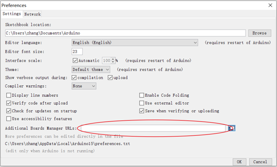
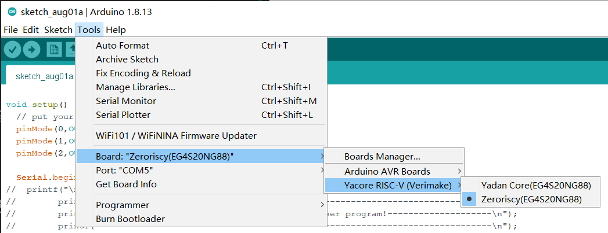

# YADAN ARDUINO

#### 介绍
这里是Yadan Arduino IDE开发板工具库

#### 安装教程

1.  在使用Arduino IDE进行Yadan程序开发时候首先需要安装Yadan board的相关配置文件以及工具。首先打开Arduino IDE，选择File->Preferences，在下图的框内填写Yadan board的配置文件的地址：https://raw.githubusercontent.com/Edwin-zzp/YadanArduino/main/package_vermake_core_index.json

  

2.  完成后点击ok，然后选择Tools->Board->Board Manager…，在搜索栏中输入Yadan搜索，点击Install，安装完成后点击close。

3.  安装完成后在Tools->Board中就可以选择Yadan Core RISC-V（verimake）开发板。目前支持两个内核：Yadan 和 Zeroriscy。
  

#### 使用说明

1.  目前支持Arduino的大部分函数，支持串口，定时器，spi。
2.  PWM对于所有IO都支持，频率为200Hz
3.  目前不支持AD和硬件IIC。

#### 即将支持
1、硬件IIC

2、两路AD

